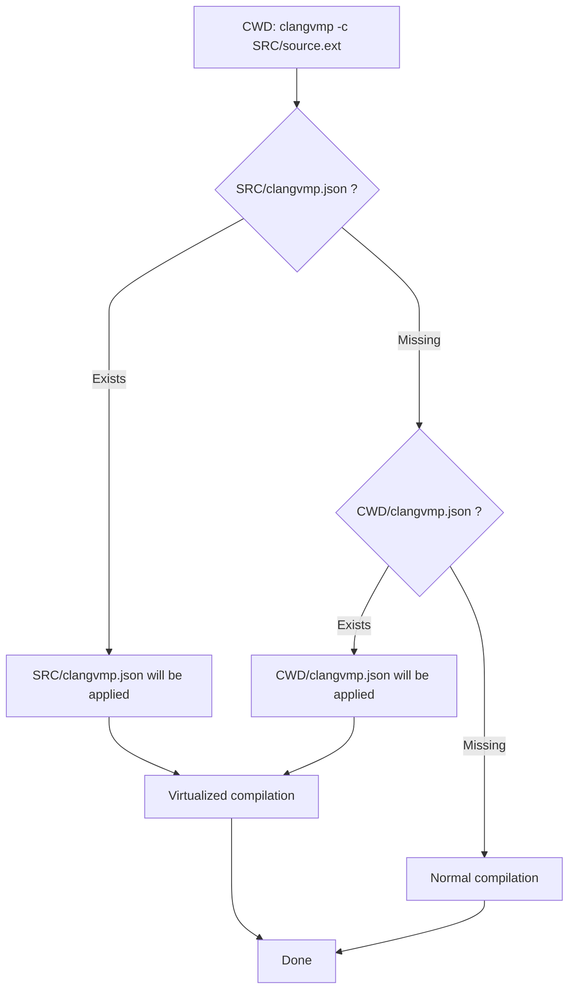

```mermaid
flowchart TD
    A[CWD: clangvmp -c SRC/source.ext] --> B{SRC/clangvmp.json ?}
    B -->|Exists| C[SRC/clangvmp.json will be applied]
    C --> D[Virtualized compilation]
    D --> E[Done]
    B ---->|Missing| F{CWD/clangvmp.json ?}
    F -->|Exists| G[CWD/clangvmp.json will be applied]
    F ---->|Missing| H[Normal compilation]
    G --> D
    H --> E
```
