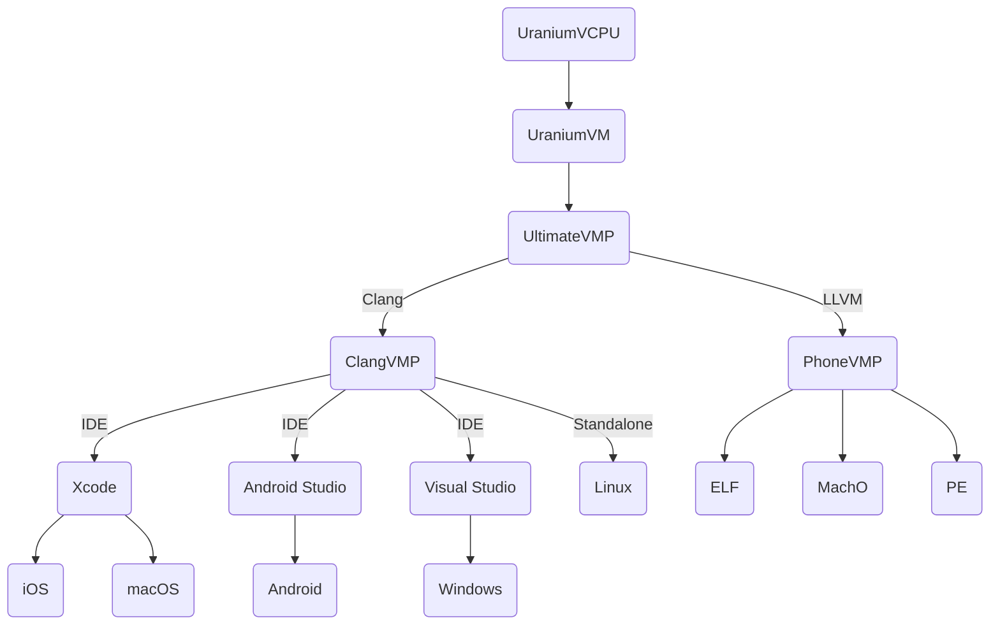

```mermaid
graph TB
    A(UraniumVCPU) --> B(UraniumVM)
    B --> C(UltimateVMP)
    C --Clang--> D(ClangVMP)
    C --LLVM--> E(PhoneVMP)
    D --IDE --> F(Xcode)
    D --IDE --> G(Android Studio)
    D --IDE --> H(Visual Studio)
    D --Standalone --> HH(Linux)
    F --> I(iOS)
    F --> J(macOS)
    G --> K(Android)
    H --> L(Windows)
    E --> M(ELF)
    E --> N(MachO)
    E --> O(PE)
```
