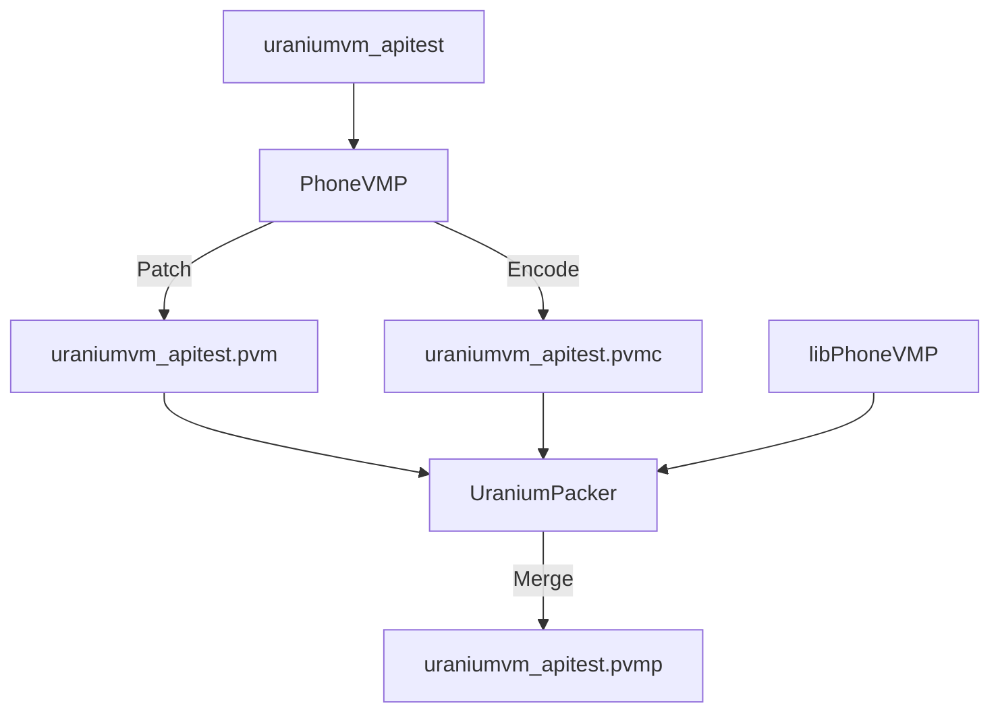

```mermaid
graph TB
    A[uraniumvm_apitest] --> B[PhoneVMP]
    B --Patch--> C[uraniumvm_apitest.pvm]
    B --Encode--> D[uraniumvm_apitest.pvmc]
    C --> E[UraniumPacker]
    D --> E
    F[libPhoneVMP] --> E
    E --Merge--> G[uraniumvm_apitest.pvmp]
```